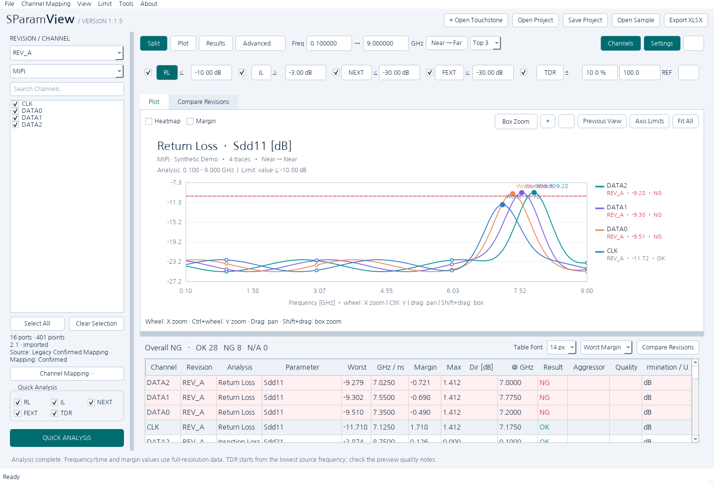
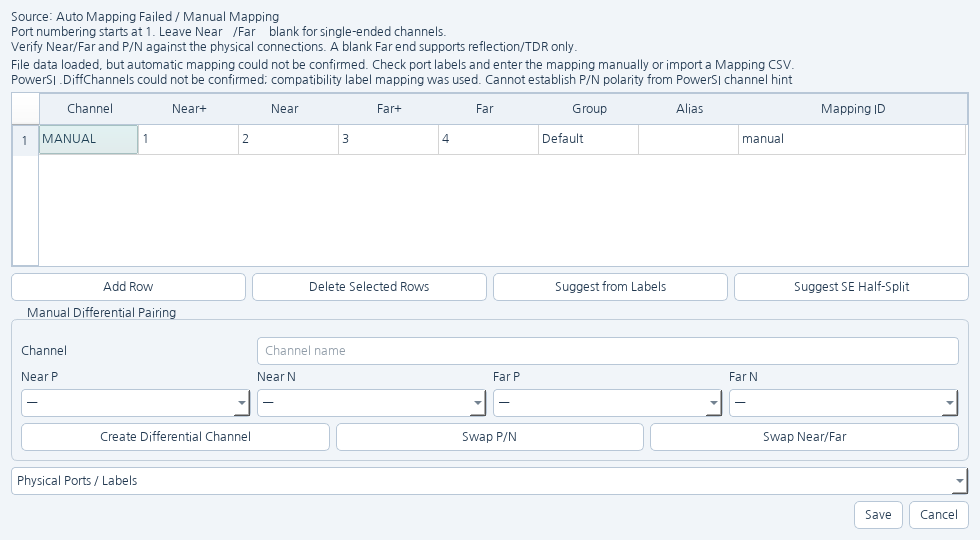
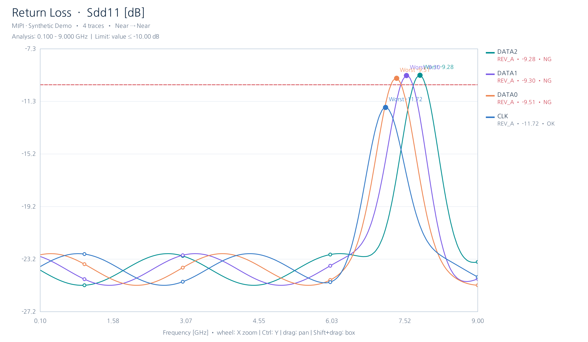

# SParamView 사용자 설명서

**적용 기준:** SParamView v1.1.5 공개 릴리스  
**지원 플랫폼:** Windows x64 / Windows ARM64 / macOS Apple Silicon (arm64)

[English User Guide](USER_GUIDE_EN.md) | [한국어 README](../README_KO.md) | [v1.1.5 Release Notes](Release_1.1.5.md)

---

## 1. SParamView 소개

SParamView는 Touchstone S-parameter 데이터를 열어 채널 단위로 분석하고 시각화하는 데스크톱 도구입니다. 주요 분석 기능은 다음과 같습니다.

- Return Loss (RL / S11 / Sdd11)
- Insertion Loss (IL / S21 / Sdd21)
- NEXT (Near-End Crosstalk)
- FEXT (Far-End Crosstalk)
- Quick TDR
- Single-ended / Differential 채널 매핑
- 사용자 Limit에 따른 OK / NG / N/A 판정
- Revision 비교
- `.siproject` 프로젝트 저장/불러오기
- Excel, PNG, CSV 및 Mapping CSV 내보내기

> **중요 안내**  
> SParamView는 제공된 Touchstone 데이터를 계산하고 시각화하는 **엔지니어링 참고 도구**입니다. 입력 데이터의 상태, 주파수 범위, 포트/채널 매핑, 보간·근사, 종단 조건 및 기타 분석 설정에 따라 표시 결과가 실제 시스템 또는 계측 결과와 다를 수 있습니다. 중요한 설계 판단은 원본 데이터와 신뢰할 수 있는 별도의 계측 또는 분석 결과로 다시 확인하십시오.

특히 **Quick TDR은 제한된 주파수 대역으로부터 계산한 추정값**이며 실제 TDR 계측기를 대체하지 않습니다.

---

## 2. 설치 및 처음 실행

### 2.1 릴리스 파일 선택

GitHub Releases에서 사용 중인 시스템에 맞는 패키지를 선택합니다.

| 시스템 | 권장 패키지 |
|---|---|
| Windows x64 | `SParamView_Windows_x64_v1.1.5.zip` |
| Windows ARM64 | `SParamView_Windows_ARM64_v1.1.5.zip` |
| macOS Apple Silicon | `SParamView_macOS_AppleSilicon_arm64_v1.1.5.dmg` 또는 `.zip` |

릴리스에는 SHA-256 확인용 파일도 함께 제공됩니다. 다운로드 무결성을 확인하려면 Windows PowerShell에서 `Get-FileHash <파일명> -Algorithm SHA256`, macOS Terminal에서 `shasum -a 256 <파일명>`을 실행한 뒤 릴리스의 `.sha256` 값과 비교할 수 있습니다.

### 2.2 Windows

ZIP 파일을 압축 해제한 뒤 SParamView 실행 파일을 실행합니다. 운영체제의 평판 또는 보안 경고가 표시될 수 있으므로, 다운로드 위치와 파일의 SHA-256을 확인한 뒤 조직의 보안 정책에 따라 실행 여부를 결정하십시오.

### 2.3 macOS Apple Silicon

현재 공개 macOS 패키지는 **ad-hoc 서명** 상태이며 Apple notarization은 적용되어 있지 않습니다. 따라서 Gatekeeper 경고가 표시될 수 있습니다. 공식 GitHub 릴리스에서 받은 파일인지 확인하고 SHA-256을 검증한 뒤, 신뢰할 수 있는 경우 macOS의 **System Settings > Privacy & Security**에서 실행 허용 절차를 사용할 수 있습니다.

> 보안 경고를 우회할지는 사용자의 시스템 및 조직 보안 정책에 따라 판단하십시오.

---

## 3. 빠른 시작

처음 사용할 때는 아래 순서만 따르면 됩니다.

```text
Touchstone 열기
      ↓
Channel Mapping 확인/확정
      ↓
Revision 및 Channel 선택
      ↓
필요한 분석 항목 선택
      ↓
QUICK ANALYSIS
      ↓
Plot / Results 확인
      ↓
필요하면 Limit 설정 후 다시 분석
      ↓
Project 저장 또는 XLSX / PNG / CSV Export
```

화면 하단 안내도 기본 흐름을 `Open file → Confirm mapping → Select channels → QUICK ANALYSIS` 순서로 안내합니다.

---

## 4. 메인 화면 구성

> **자동 검증 화면** — 아래 이미지는 SParamView v1.1.5 네이티브 Windows ARM64 검증에서 synthetic sample project를 사용해 프로그램이 자동 생성한 화면입니다. OS, DPI 및 창 크기에 따라 실제 배치는 조금 달라질 수 있습니다.



### 4.1 상단 바로가기

v1.1.5의 상단에는 다음 버튼이 배치됩니다.

- **+ Open Touchstone**: Touchstone 파일 열기
- **Open Project**: `.siproject` 프로젝트 열기
- **Save Project**: 현재 프로젝트 저장
- **Open Sample**: 포함된 샘플 프로젝트 열기
- **Export XLSX**: 완료된 분석 결과를 Excel Workbook으로 내보내기

### 4.2 왼쪽 Channel 영역

- **REVISION / CHANNEL**: 현재 Revision 선택
- **All groups**: 채널 Group 필터
- **Search Channels...**: 채널 이름 검색
- **Select All / Clear Selection**: 현재 표시 채널 전체 선택/해제
- **Channel Mapping...**: 포트와 논리 채널 매핑 확인/수정
- **Quick Analysis**: RL / IL / NEXT / FEXT / TDR 선택
- **QUICK ANALYSIS**: 체크된 항목을 실행

### 4.3 상단 Analysis / View 영역

- **Split / Plot / Results**: 화면 배치 전환
- **Advanced**: 고급 설정 표시
- **Freq**: 분석 주파수 범위(GHz)
- **Near → Far / Far → Near / Both**: 표시 방향 선택
- **Worst / Top 3 / Top 5 / Off**: 자동 마커 표시 수
- **Channels / Settings / Full Screen**: 패널 및 전체 화면 표시 제어

### 4.4 Plot 및 Results

Plot 영역은 현재 분석 그래프를 보여주며, Results 영역은 채널별 Worst 값, 위치, Margin, 방향 차이, 판정, Aggressor, Quality 등을 표로 표시합니다.

---

## 5. Touchstone 파일 열기

**+ Open Touchstone** 또는 **File > Open Touchstone...**을 사용합니다. `*.s*p`와 `*.ts` 형식을 선택할 수 있으며 여러 파일을 한 번에 열어 Revision으로 비교할 수 있습니다.

파일을 연 뒤에는 **Channel Mapping을 반드시 확인**하십시오. 파일 파싱이 성공해도 포트 이름만으로 Near/Far 또는 P/N 관계를 확실히 판단할 수 없는 경우 자동 매핑이 확정되지 않을 수 있습니다.

SParamView는 원본 Touchstone 파일을 수정하지 않고 로컬에서 읽어 분석합니다.

---

## 6. Channel Mapping

아래 화면은 자동 매핑을 확정할 수 없는 입력을 검증하는 테스트에서 SParamView가 자동 생성한 Channel Mapping 창입니다. 이런 경우 포트 관계를 확인한 뒤 수동 매핑 또는 Mapping CSV로 확정할 수 있습니다.



분석 정확도에서 가장 중요한 단계입니다. 잘못된 매핑은 계산 자체가 정상이어도 잘못된 RL/IL/NEXT/FEXT/TDR 결과를 만들 수 있습니다.

### 6.1 기본 규칙

- 포트 번호는 **1부터 시작**합니다.
- Single-ended 채널은 `Near−`, `Far−`를 비워 둡니다.
- Differential 채널은 Near P/N을 한 쌍으로 지정합니다.
- Far P/N을 사용하려면 두 포트를 모두 지정해야 합니다.
- Far 쪽을 비워 둔 채널은 reflection/TDR 중심으로 사용할 수 있습니다.
- Near/Far 및 P/N 방향은 실제 물리 연결과 반드시 대조하십시오.

### 6.2 매핑 창의 주요 열

| 열 | 의미 |
|---|---|
| Channel | 논리 채널 이름 |
| Near+ / Near− | Near-end P/N 포트 |
| Far+ / Far− | Far-end P/N 포트 |
| Group | NEXT/FEXT Aggressor 자동 선택에 사용되는 그룹 |
| Alias | 사용자 별칭 |
| Mapping ID | Revision 사이에서 채널을 식별하기 위한 ID |

### 6.3 편집 기능

매핑 창에서는 행 추가/삭제, Label 기반 제안, Single-ended Half-Split 제안, Differential 채널 수동 생성, P/N 교환, Near/Far 교환을 사용할 수 있습니다. 또한 **Channel Mapping > Import Mapping CSV... / Export Mapping CSV...**로 매핑을 재사용할 수 있습니다.

자동 제안이 불확실하면 기존 데이터를 임의로 확정하지 않고 사용자 확인을 요구합니다. 매핑을 저장하면 해당 Revision의 기존 분석 결과는 무효화되므로 다시 분석해야 합니다.

### 6.4 100 Ω Differential과 50 Ω-to-GND의 차이

다음 두 조건은 서로 다릅니다.

- **Differential P–N 100 Ω**: P와 N 사이의 100 Ω 부하
- **P–GND 50 Ω + N–GND 50 Ω**: P와 N이 각각 GND에 50 Ω로 연결

SParamView의 TDR termination 옵션에서도 두 조건을 별도로 구분합니다.

---

## 7. 분석 실행

### 7.1 Quick Analysis

왼쪽 **Quick Analysis**에서 필요한 항목을 체크한 뒤 **QUICK ANALYSIS**를 누릅니다. 기본 항목은 다음과 같습니다.

- RL
- IL
- NEXT
- FEXT
- TDR

적어도 하나의 분석 항목과 하나 이상의 채널이 선택되어 있어야 합니다. 또한 모든 Revision의 매핑이 확정되어 있어야 합니다.

### 7.2 개별 분석

상단 Settings 영역의 **RL / IL / NEXT / FEXT / TDR** 버튼을 누르면 해당 결과가 이미 현재 설정으로 계산되어 있을 경우 즉시 표시하고, 그렇지 않으면 해당 분석을 계산합니다.

### 7.3 방향 선택

방향 버튼은 다음 세 상태를 순환합니다.

1. **Near → Far**
2. **Far → Near**
3. **Both**

RL/IL의 경우 양 방향 결과가 존재하면 Results의 `Max ΔDir [dB]`, `Δ @ GHz`에서 최대 방향 차이를 확인할 수 있습니다.

---

## 8. RL / IL / NEXT / FEXT 해석

### 8.1 Return Loss

SParamView는 RL 결과를 Single-ended에서는 **S11**, Differential에서는 **Sdd11** 표기와 함께 사용합니다. 현재 Limit 입력은 `≤` 조건입니다. 예를 들어 Limit이 `-10 dB`라면 `-10 dB 이하`의 값이 기준을 만족합니다.

아래 자동 검증 그래프는 synthetic differential sample의 **Sdd11 Return Loss** 예시입니다. 붉은 점선은 활성 Limit이고, 각 trace의 Worst point와 OK/NG 상태를 함께 확인할 수 있습니다.



### 8.2 Insertion Loss

IL은 Single-ended의 **S21**, Differential의 **Sdd21**에 대응하여 표시합니다. 현재 Limit 입력은 `≥` 조건입니다. 예를 들어 `-3 dB` Limit이면 `-3 dB 이상`이 기준을 만족합니다.

### 8.3 NEXT

NEXT는 Near-end aggressor가 Near-end victim에 미치는 누화 응답입니다. Limit은 `≤` 조건입니다.

### 8.4 FEXT

FEXT는 Near-end aggressor가 Far-end victim에 미치는 누화 응답입니다. Limit은 `≤` 조건입니다.

NEXT/FEXT는 기본적으로 **같은 Group에 속한 다른 채널**을 Aggressor 후보로 사용합니다. Advanced의 **Aggressor**에서 특정 채널을 선택할 수도 있습니다.

---

## 9. Limit 및 OK / NG / N/A

Pass/Fail 판정은 사용자가 해당 Limit 체크박스를 활성화했을 때만 의미가 있습니다.

| 분석 | 기본 판정 관계 |
|---|---|
| RL | 측정/계산값 ≤ Limit |
| IL | 측정/계산값 ≥ Limit |
| NEXT | 측정/계산값 ≤ Limit |
| FEXT | 측정/계산값 ≤ Limit |
| TDR | Target Ω ± Tolerance % |

결과 상태는 다음과 같습니다.

- **OK**: 활성화된 Limit을 만족
- **NG**: 활성화된 Limit 위반 검출
- **N/A**: 해당 조건에서 판정을 만들 수 없음

> **N/A는 PASS가 아닙니다.** Limit이 비활성화되었거나, 정의된 주파수 Limit 범위 밖이거나, 판정 조건이 충족되지 않는 경우 N/A가 될 수 있습니다.

### 9.1 주파수별 Limit

**Limit > Edit Frequency Limits...** 또는 Advanced의 **Frequency Limit...**을 사용하면 `GHz, dB` 형식으로 여러 점을 입력할 수 있습니다.

```text
1, -10
3, -12
6, -15
```

정의된 점 사이에서는 Limit을 구성할 수 있지만 **정의 범위 밖으로 Limit을 외삽하지 않으며 해당 구간은 N/A**로 취급됩니다. 텍스트를 비우면 constant limit 방식으로 돌아갑니다.

Limit 설정은 JSON Preset으로 저장/불러올 수 있습니다.

---

## 10. Quick TDR

### 10.1 가장 중요한 주의사항

Quick TDR은 Touchstone의 유한한 주파수 대역 데이터를 시간 영역으로 변환해 보는 **빠른 추정 도구**입니다. 결과는 다음 요소의 영향을 받습니다.

- 사용 가능한 주파수 범위와 주파수 간격
- 저주파/DC 정보의 유무와 처리
- 보간/근사 및 windowing
- 채널 매핑
- 기준 임피던스
- 반대쪽 종단 조건

따라서 실제 TDR 계측 결과와 동일하다고 해석하지 마십시오.

### 10.2 Target과 표시 스케일

`Auto Z₀` 사용 시 현재 UI는 Single-ended와 Differential TDR을 별도 스케일로 표시하며 명목상 Single-ended는 **50 Ω**, Differential은 **100 Ω**를 기준으로 사용합니다. 필요한 경우 Target Ω를 직접 지정할 수 있습니다.

### 10.3 TDR Limit

TDR Limit 체크박스를 활성화하면 **Target ± Tolerance %** 기준으로 판정합니다. 예를 들어 100 Ω, ±10%라면 허용 범위는 90~110 Ω입니다.

### 10.4 Termination 옵션

TDR의 톱니바퀴(⚙) 버튼에서 여러 조건을 동시에 선택해 overlay할 수 있습니다.

- **Reference**: source reference impedance에 정합
- **Resistive**: SE 50 Ω / Differential P–N 100 Ω (floating)
- **Grounded**: SE 50 Ω / Differential P–GND 50 Ω + N–GND 50 Ω
- **Open**: SE open / Differential P와 N 모두 open
- **Short**: SE–GND short / Differential P–N short (floating)

Forward 분석에서는 Far 쪽, Reverse 분석에서는 Near 쪽에 선택한 termination을 적용하며 나머지 물리 포트는 source reference impedance에 정합됩니다. Single-ended의 두 50 Ω 조건은 등가이므로 한 번만 계산됩니다.

**Show Reflection Coefficient ρ**를 활성화하면 Open/Short 비교에 유용한 반사계수를 볼 수 있습니다. 이 경우 impedance tolerance Limit은 ρ에 적용되지 않습니다.

---

## 11. Plot 사용법

Plot은 다음 조작을 지원합니다.

| 조작 | 기능 |
|---|---|
| Mouse Wheel | X축 확대/축소 |
| Ctrl + Wheel | Y축 확대/축소 |
| Drag | Pan |
| Shift + Drag | Box Zoom |
| `+` / `−` | 확대/축소 |
| Home | Fit All |
| Backspace | Previous View |
| Axis Limits | X/Y 범위 직접 지정 |
| Fit All | 전체 데이터 범위로 복귀 |

비-TDR 그래프에서 Heatmap 및 Margin 보기를 사용할 수 있습니다. Plot 위 커서는 현재 위치의 주파수/시간과 표시 trace 값을 보여줍니다.

---

## 12. Results 표 읽기

주요 열은 다음과 같습니다.

- **Channel**: 논리 채널
- **Revision**: 소스 Revision
- **Analysis**: RL / IL / NEXT / FEXT / TDR
- **Parameter**: S11, S21, Sdd11 등 실제 표시 파라미터
- **Worst**: 분석 범위에서의 worst 값
- **GHz / ns**: worst 값 위치
- **Margin**: 활성 Limit 대비 margin
- **Max ΔDir [dB] / Δ @ GHz**: RL/IL 양 방향 최대 차이
- **Result**: OK / NG / N/A
- **Aggressor**: NEXT/FEXT aggressor
- **Quality**: 계산/preview 품질 정보
- **Termination / Unit**: TDR termination 및 Ω/ρ, 또는 dB

상단 Summary는 전체 결과의 OK / NG / N/A 개수를 보여줍니다. 정렬은 **Worst Margin / Worst Value / Channel / Result** 기준으로 바꿀 수 있습니다.

---

## 13. Revision 비교

여러 Touchstone 파일을 Revision으로 열면 동일 논리 채널을 비교할 수 있습니다.

- 최소 2개 Revision이 필요합니다.
- 모든 Revision의 매핑이 확정되어 있어야 합니다.
- RL/IL/NEXT/FEXT는 비교 결과의 dB 차이를 확인할 수 있습니다.
- TDR은 Compare 표의 dB delta 대신 **Plot overlay**로 비교합니다.

Revision 간 비교를 신뢰하려면 같은 물리 신호가 동일한 논리 Channel/Mapping으로 대응되는지 먼저 확인하십시오.

---

## 14. Project 저장과 복원

### 14.1 저장

상단 **Save Project** 또는 **File > Save Project**를 사용합니다. 새 파일명으로 저장하려면 **File > Save Project As...**를 사용합니다.

`.siproject`에는 분석 설정, Revision 정보, Channel Mapping, 선택 채널, 일부 UI 상태와 원본 Touchstone 경로/해시 정보가 저장됩니다.

> **중요:** `.siproject`는 원본 Touchstone 데이터를 프로젝트 파일 안에 완전히 포함하는 포맷이 아닙니다. 프로젝트를 다른 PC로 옮길 때는 관련 Touchstone 파일도 함께 보관하는 것을 권장합니다.

### 14.2 불러오기

상단 **Open Project** 또는 **File > Open Project...**를 사용합니다. 저장 당시의 상대 경로에서 원본 파일을 찾지 못하면 절대 경로를 확인하고, 그래도 없으면 사용자에게 원본 Touchstone 위치를 다시 지정하도록 요청합니다.

원본 Touchstone의 SHA-256이 저장 시점과 달라졌다면 해당 Revision의 mapping confirmation이 해제될 수 있으므로 다시 확인해야 합니다.

---

## 15. Export

### 15.1 Excel Workbook

**Export XLSX** 또는 **File > Export Excel Workbook...**을 사용합니다. 다음 항목을 선택할 수 있습니다.

- Summary
- Detailed results
- Graphs
- Raw trace data (large)

Raw trace data는 파일 크기가 크게 증가할 수 있습니다.

### 15.2 Plot PNG

**File > Export Plot as PNG...**으로 현재 Plot을 PNG로 저장합니다.

### 15.3 Raw CSV

Results에서 **정확히 한 행**을 선택한 뒤 **File > Export Selected Trace as CSV...**을 사용합니다. 선택된 분석 trace의 raw 데이터를 CSV로 저장합니다.

### 15.4 Mapping CSV

Channel Mapping 메뉴에서 Mapping CSV를 Import/Export할 수 있어 동일 포트 구조의 파일에 매핑을 재사용할 수 있습니다.

---

## 16. Advanced 설정

**Advanced**를 펼치면 다음 항목을 사용할 수 있습니다.

- **Marker [GHz]**: 쉼표로 구분한 수동 주파수 마커
- **Performance**: Low / Normal / Maximum
- **Aggressor**: NEXT/FEXT aggressor 지정, 기본은 `AUTO (same group)`
- **TDR time [ns]**: TDR 표시/분석 시간 범위
- **Peak prominence**: 자동 peak 검출 민감도 관련 설정
- **Frequency Limit...**: 현재 dB 분석 항목의 주파수별 Limit

설정을 변경한 뒤 기존 결과가 남아 있다면 **다시 분석해야 변경값이 계산에 반영**됩니다. Export는 마지막으로 완료된 분석 설정을 사용합니다.

---

## 17. 유용한 메뉴

### File
Touchstone/Project 열기, Project 저장, XLSX/PNG/CSV Export를 제공합니다.

### Channel Mapping
매핑 편집/확정과 CSV Import/Export를 제공합니다.

### View
Split View, Maximize Plot, Maximize Results, Channel List, Analysis Settings, Full Screen, Reset Layout을 제공합니다. `Ctrl+1 / Ctrl+2 / Ctrl+3`으로 주요 workspace 모드를 전환하고 `F11`로 Full Screen을 전환할 수 있습니다.

### Limit
Limit Preset 저장/불러오기와 주파수별 Limit 편집을 제공합니다.

### Tools
- **Open Sample Project**
- **Verify Source SHA-256**: 현재 원본 Touchstone이 분석 시점의 source hash와 일치하는지 확인

---

## 18. 문제 해결

| 증상 | 확인할 내용 |
|---|---|
| Touchstone은 열렸지만 채널 분석이 안 됨 | Channel Mapping이 확정되었는지 확인 |
| Channel Mapping이 자동으로 확정되지 않음 | Port label이 모호할 수 있으므로 수동 매핑 또는 Mapping CSV 사용 |
| QUICK ANALYSIS가 실행되지 않음 | 채널과 분석 항목을 하나 이상 선택했는지 확인 |
| NEXT/FEXT 결과가 없음 | Victim 외에 같은 Group의 유효한 Aggressor와 Near/Far 매핑이 있는지 확인 |
| Result가 N/A | Limit 활성화 여부, 주파수 Limit 범위, 판정 가능 조건 확인 |
| 설정을 바꿨는데 결과가 그대로임 | 설정 변경 후 분석을 다시 실행 |
| TDR가 예상과 크게 다름 | 주파수 span/spacing, mapping, target Z₀, termination, source 품질 확인 |
| Project가 원본 파일을 찾지 못함 | Touchstone 위치를 다시 지정; 파일이 변경되었다면 mapping 재확인 |
| CSV Export가 안 됨 | Results에서 정확히 한 행 선택 |
| XLSX Export가 안 됨 | 먼저 분석을 완료했는지 확인 |
| macOS에서 실행 경고 | 공식 릴리스/SHA-256 확인 후 macOS Privacy & Security 정책 확인 |

문제가 재현된다면 사용한 SParamView 버전, 운영체제/아키텍처, Touchstone 포트 수, 문제 재현 순서와 오류 메시지를 함께 기록하면 원인 분석에 도움이 됩니다.

---

## 19. 샘플 데이터

저장소의 `examples/`에는 UI 및 회귀시험을 위한 synthetic demonstration fixture가 포함되어 있습니다. 실제 제품의 측정 데이터가 아닙니다. **Open Sample** 또는 **Tools > Open Sample Project**로 기본 사용 흐름을 시험할 수 있습니다.

---

## 20. 데이터 및 개인정보

SParamView의 분석 처리는 로컬에서 수행되며 원본 Touchstone 파일은 읽기 전용으로 사용됩니다. Project와 Export 파일은 사용자가 지정한 로컬 경로에 저장됩니다.

---

## 21. 지원 및 라이선스

SParamView 소스는 MIT License로 배포됩니다. Third-party component와 font는 각각의 라이선스를 유지합니다. 자세한 내용은 저장소의 `LICENSE`, `COPYRIGHT.txt`, `third_party/`를 확인하십시오.

문의: **sparamview@gmail.com**

---

### 문서 버전

이 문서는 **SParamView v1.1.5 공개 릴리스**의 UI와 소스를 기준으로 작성되었습니다. 이후 버전에서는 메뉴, 기능 또는 분석 설정이 달라질 수 있습니다.
